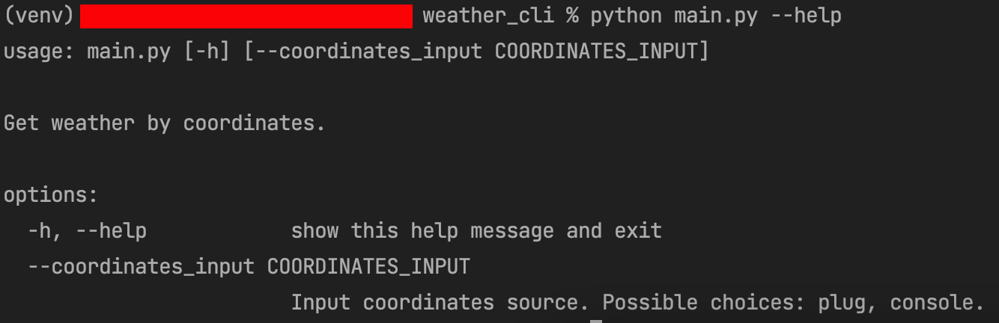
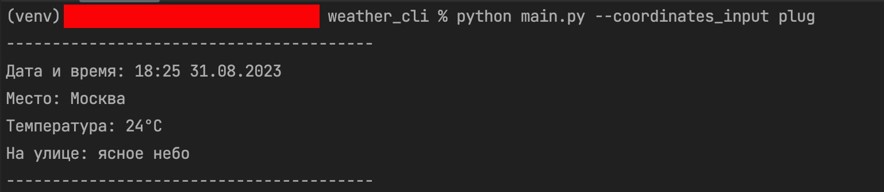
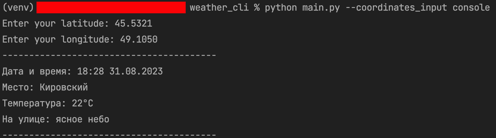

## Консольная программы для определения погода по координатам

Запустите в корневой директории репозитория команду `python3 main.py --help` 
или `python main.py --help` для просмотра информации об аргументах программы:

Пример запуска программы с вводом-"заглушкой" (`plug`):

**_P.S. "Заглушка" имеет координаты центра Москвы._**

Пример запуска программы с вводом с консоли (`console`):

